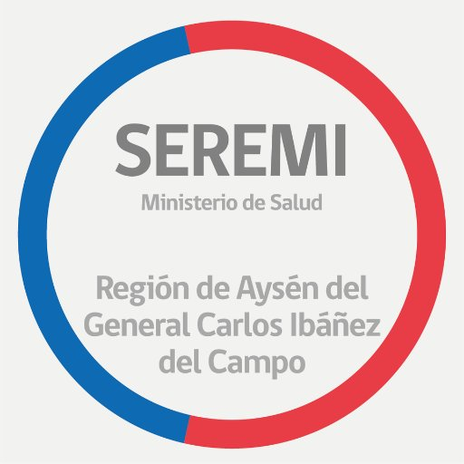

[![Contributors][contributors-shield]][contributors-url]
[![Forks][forks-shield]][forks-url]
[![Stargazers][stars-shield]][stars-url]
[![Issues][issues-shield]][issues-url]
[![MIT License][license-shield]][license-url]
[![LinkedIn][linkedin-shield]][linkedin-url]


<!-- PROJECT LOGO -->
<br />
<p align="center">
  <a href="https://github.com/millacurafa/SeremiSaludAysenCovid">
    
  </a>

  <h3 align="center">Seremi de Salud Aysén</h3>

  <p align="center">
    project_description
    <br />
    <a href="https://github.com/millacurafa/SeremiSaludAysenCovid"><strong>Explorar la documentación»</strong></a>
    <br />
    <br />
    <a href="https://github.com/millacurafa/SeremiSaludAysenCovid">Ver Demo</a>
    ·
    <a href="https://github.com/millacurafa/SeremiSaludAysenCovid/issues">Reportar Bug</a>
    ·
    <a href="https://github.com/millacurafa/SeremiSaludAysenCovid/issues">Solicitar característica</a>
  </p>
</p>


<!-- TABLE OF CONTENTS -->
<details open="open">
  <summary><h2 style="display: inline-block">Tabla de Contenidos</h2></summary>
  <ol>
    <li>
      <a href="#about-the-project">Sobre el Proyecto</a>
      <ul>
        <li><a href="#built-with">Hecho con</a></li>
      </ul>
    </li>
    <li>
      <a href="#getting-started">Comenzando</a>
      <ul>
        <li><a href="#prerequisites">Pré-requisitos</a></li>
        <li><a href="#installation">Instalación</a></li>
      </ul>
    </li>
    <li><a href="#usage">Ejemplos de Uso</a></li>
    <li><a href="#roadmap">Roadmap</a></li>
    <li><a href="#contributing">Contribuciones</a></li>
    <li><a href="#license">Licencia</a></li>
    <li><a href="#contact">Contacto</a></li>
    <li><a href="#acknowledgements">Agradecimientos</a></li>
  </ol>
</details>


<!-- ABOUT THE PROJECT -->
## Sobre el Proyecto

Multiples archivos contienen datos analizados para 

.png?raw=true)

?raw=true)

?raw=true)

?raw=true)

?raw=true)

?raw=true)

?raw=true)

Here's a blank template to get started:
**To avoid retyping too much info. Do a search and replace with your text editor for the following:**
`github_username`, `repo_name`, `twitter_handle`, `email`, `project_title`, `project_description`


### Creado con

* [Python 3.8.10](https://www.python.org/downloads/release/python-3810/)
* [Pandas](https://pandas.pydata.org/)
* [Plotly](https://plotly.com/python/)


<!-- GETTING STARTED -->
## Comenzando

Para tener una copia local y funcional sigue los siguientes simples pasos.

### Pré-requisitos

Este es un ejemplo de como instalar las librerias necesarias para utilizar el software correctamente.
* pip
  ```sh
  pip install requirements.txt
  ```

### Instalación

1. Clona el repositorio
   ```sh
   git clone https://github.com/millacurafa/SeremiSaludAysenCovid.git
   ```
2. Instala los paquetes de Python necesarios
   ```sh
   pip install requirements.txt
   ```


<!-- USAGE EXAMPLES -->
## Ejemplos de Uso

Use this space to show useful examples of how a project can be used. Additional screenshots, code examples and demos work well in this space. You may also link to more resources.

_For more examples, please refer to the [Documentation](https://example.com)_


<!-- ROADMAP -->
## Roadmap

Revisa [open issues](https://github.com/millacurafa/SeremiSaludAysenCovid/issues) para ver una lista de las caracteristicas propuestas (y errores conocidos).


<!-- CONTRIBUTING -->
## Contribuciones

Las contribuciones son lo que hacen la comunidad de código abierto un excelente lugar de aprendizaje, inspiración y creación. Cualquier contribución que realices será **muy bien recibida**

1. Realiza un Fork del Proyecto
2. Crea una rama para tu Feature  (`git checkout -b feature/AmazingFeature`)
3. Haz un Commit de tus cambios (`git commit -m 'Agrega un AmazingFeature'`)
4. Haz Push de la rama creada (`git push origin feature/AmazingFeature`)
5. Abre una solicitud de Pull


<!-- LICENSE -->
## Licencia

Distribuido bajo licencia MIT. Ver `LICENSE` para mayor información.


<!-- CONTACT -->
## Contacto

Link del proyecto: [https://github.com/millacurafa/SeremiSaludAysenCovid](https://github.com/millacurafa/SeremiSaludAysenCovid)


<!-- ACKNOWLEDGEMENTS -->
## Agradecimientos

* [Miguel Oyarzo](https://github.com/MiguelOyarzo)
* [Pablo Briones](https://github.com/pbrionespatagon)
* [Fabián Méndez]()
* [Felipe Millacura](https://github.com/millacurafa)


<!-- MARKDOWN LINKS & IMAGES -->
<!-- https://www.markdownguide.org/basic-syntax/#reference-style-links -->
[contributors-shield]: https://img.shields.io/github/contributors/millacurafa/repo.svg?style=for-the-badge
[contributors-url]: https://github.com/millacurafa/SeremiSaludAysenCovid/graphs/contributors
[forks-shield]: https://img.shields.io/github/forks/SeremiSaludAysenCovid/SeremiSaludAysenCovid.svg?style=for-the-badge
[forks-url]: https://github.com/millacurafa/SeremiSaludAysenCovid/network/members
[stars-shield]: https://img.shields.io/github/stars/millacurafa/SeremiSaludAysenCovid.svg?style=for-the-badge
[stars-url]: https://github.com/millacurafa/SeremiSaludAysenCovid/stargazers
[issues-shield]: https://img.shields.io/github/issues/millacurafa/SeremiSaludAysenCovid.svg?style=for-the-badge
[issues-url]: https://github.com/millacurafa/SeremiSaludAysenCovid/issues
[license-shield]: https://img.shields.io/github/license/millacurafa/SeremiSaludAysenCovid.svg?style=for-the-badge
[license-url]: https://github.com/millacurafa/SeremiSaludAysenCovid/blob/main/LICENSE
[linkedin-shield]: https://img.shields.io/badge/-LinkedIn-black.svg?style=for-the-badge&logo=linkedin&colorB=555
[linkedin-url]: https://linkedin.com/in/millacurafa
